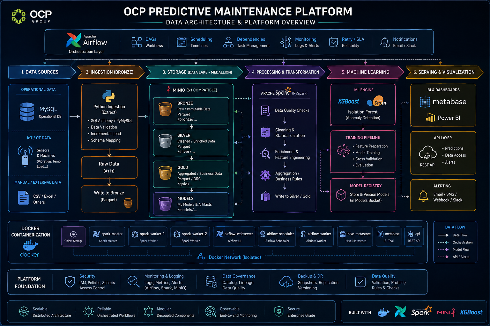

# Architecture générale

## 1. Vue d'ensemble

Présentation en quelques lignes de l'architecture et de ses objectifs.



---

## 2. Principes architecturaux

* Architecture modulaire
* Séparation des responsabilités
* Medallion Architecture
* Traitements distribués
* Orchestration avec Airflow
* Conteneurisation avec Docker
* Data Quality intégrée au pipeline
* Traçabilité et observabilité

---

## 3. Architecture logique

### 3.1 Sources de données

* MySQL
* Données IoT / OT


### 3.2 Ingestion

**Technologies :**

* Python
* SQLAlchemy
* PyMySQL
* Pandas
* PyArrow

**Responsabilité :**
Extraction des données et dépôt dans MinIO — Bronze.

### 3.3 Data Lake

**MinIO — S3 compatible**

```text
Bronze
   ↓
Silver
   ↓
Gold
```

* **Bronze** : données brutes
* **Silver** : données nettoyées, standardisées et enrichies
* **Gold** : données préparées pour l'analyse métier
* **Models** : modèles et artefacts ML

### 3.4 Transformation

**Apache Spark / PySpark** (l'order d'exécution)

```text
Bronze
   ↓
Data Quality
   ↓
Cleaner
   ↓
Data Quality
   ↓
Standardizer
   ↓
Data Quality
   ↓
Enricher
   ↓
Data Quality
   ↓
Silver
```

### 3.5 Machine Learning

* Feature Engineering
* Model Training
* Evaluation
* XGBoost
* Scikit-learn
* Isolation Forest
* Model Registry

### 3.6 Serving & Visualisation

* REST API
* Metabase
* Système d'alertes

---

## 4. Orchestration — Apache Airflow

Airflow est responsable de l'orchestration des workflows.

### Responsabilités

* Scheduling
* Gestion des dépendances
* Exécution des jobs
* Retry
* Monitoring
* Logs
* Notifications

### Workflow principal

```text
Ingestion
    ↓
Bronze
    ↓
Transformation Silver
    ↓
Gold / Analytical Processing
    ↓
Machine Learning
    ↓
Serving / BI
```

Airflow orchestre les différents traitements sans prendre en charge lui-même les traitements distribués.

---

## 5. Infrastructure — Docker

L'ensemble de la plateforme est conteneurisé avec Docker.

### Services principaux

```text
Docker Network
│
├── MinIO
│
├── Spark Master
├── Spark Worker 1
├── Spark Worker 2
│
├── Hive Metastore
│
├── Airflow Webserver
├── Airflow Scheduler
├── Airflow Worker
│
├── Metabase
│
└── REST API
```

### Rôle de Docker

Docker permet :

* l'isolation des services ;
* la reproductibilité de l'environnement ;
* la séparation des responsabilités ;
* la gestion indépendante des composants ;
* la communication entre services via un réseau Docker dédié.

---

## 6. Hive Metastore

Hive Metastore fournit la couche de métadonnées utilisée par Spark.

Il permet notamment de centraliser :

* les métadonnées des tables ;
* les schémas ;
* les informations de stockage ;
* les informations nécessaires au catalogue Hive.

```text
Spark
  │
  ▼
Hive Metastore
  │
  ▼
Data Lake / Warehouse
```

---

## 7. Flux de données global

```text
                     Apache Airflow
                           │
                           ▼
┌──────────────┐     ┌──────────────┐
│ Data Sources │ ──► │   Ingestion  │
└──────────────┘     └──────┬───────┘
                            │
                            ▼
                       ┌─────────┐
                       │ MinIO   │
                       │ Bronze  │
                       └────┬────┘
                            │
                            ▼
                    ┌───────────────┐
                    │ Spark /       │
                    │ PySpark       │
                    └───────┬───────┘
                            │
                 ┌──────────┴──────────┐
                 │ Data Quality        │
                 │ Cleaner             │
                 │ Standardizer        │
                 │ Enricher            │
                 └──────────┬──────────┘
                            │
                            ▼
                       ┌─────────┐
                       │ MinIO   │
                       │ Silver  │
                       └────┬────┘
                            │
                            ▼
                       ┌─────────┐
                       │  Gold   │
                       └────┬────┘
                            │
                 ┌──────────┴──────────┐
                 ▼                     ▼
          Machine Learning       BI / Analytics
                 │                     │
                 ▼                     ├── Metabase
             Models                    └── Power BI
                 │
                 ▼
              REST API
                 │
                 ▼
             Applications
```

---

## 8. Services et responsabilités

| Service        | Responsabilité             |
| -------------- | -------------------------- |
| MySQL          | Source opérationnelle      |
| Python         | Ingestion                  |
| MinIO          | Data Lake                  |
| Spark          | Traitement distribué       |
| Hive Metastore | Métadonnées                |
| Airflow        | Orchestration              |
| XGBoost        | Machine Learning           |
| Scikit-learn   | ML / détection d'anomalies |
| Metabase       | BI                         |
| Power BI       | Reporting                  |
| REST API       | Serving                    |
| Docker         | Conteneurisation           |

---

## 9. Sécurité, qualité et observabilité

Les différents composants transverses de la plateforme assurent :

### Sécurité

* gestion des credentials ;
* isolation réseau ;
* gestion des secrets ;
* contrôle des accès.

### Data Quality

* validation du schéma ;
* validation des colonnes obligatoires ;
* contrôle des valeurs NULL ;
* contrôle des plages numériques.

### Observabilité

* logs applicatifs ;
* logs Airflow ;
* logs Spark ;
* suivi des DAGs ;
* gestion des erreurs ;
* notifications.

---

## 10. Évolution de l'architecture

L'architecture est conçue pour pouvoir évoluer progressivement vers :

* davantage de sources IoT ;
* davantage de Workers Spark ;
* de nouveaux pipelines Airflow ;
* de nouveaux cas d'usage ML ;
* de nouveaux modèles de prédiction ;
* de nouveaux dashboards ;
* une exposition plus large via l'API.

---

## 11. Résumé

L'architecture repose sur une séparation claire des responsabilités :

```text
Airflow  → Orchestration
Docker   → Infrastructure
Python   → Ingestion
MinIO    → Data Lake
Spark    → Transformation
Hive     → Metadata
ML       → Prediction
API      → Serving
BI       → Visualization
```

Cette organisation permet de construire une plateforme **modulaire, scalable, reproductible, observable et évolutive**.
